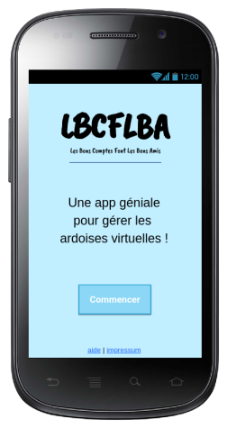
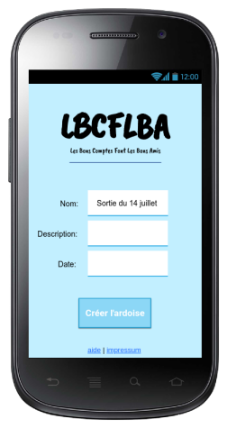
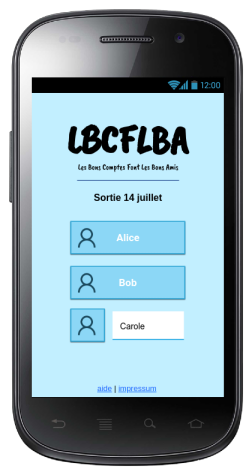
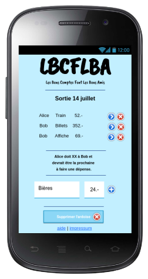

# Kata LBCFLBA «Les Bons Comptes Font Les Bons Amis»

<!-- TOC titleSize:1 tabSpaces:2 depthFrom:1 depthTo:6 withLinks:1 updateOnSave:1 orderedList:0 skip:1 title:1 charForUnorderedList:- -->
# Table of Contents
- [À propos](#à-propos)
- [Vue d’ensemble](#vue-densemble)
- [Informations générales](#informations-générales)
- [Matériel et logiciel à disposition](#matériel-et-logiciel-à-disposition)
- [Descriptif du projet](#descriptif-du-projet)
  - [Technologies](#technologies)
  - [Maquettes](#maquettes)
  - [Exemple de cas d’emploi](#exemple-de-cas-demploi)
  - [Fonctionnement général](#fonctionnement-général)
  - [Écrans de l’application](#écrans-de-lapplication)
    - [Écran d’accueil](#écran-daccueil)
    - [Écran de création d’ardoise](#écran-de-création-dardoise)
    - [Écran de saisie et consultation](#écran-de-saisie-et-consultation)
    - [Écran de rapport](#écran-de-rapport)
    - [Écran d’aide](#écran-daide)
    - [Écran à propos](#écran-à-propos)
- [Livrables](#livrables)
  - [Planification](#planification)
  - [Code](#code)
  - [Dossier de projet](#dossier-de-projet)
    - [Rapport](#rapport)
    - [Annexes](#annexes)
  - [Journal de travail](#journal-de-travail)
  - [Application et code](#application-et-code)
- [Points techniques évalués spécifiques au projet](#points-techniques-évalués-spécifiques-au-projet)
- [Conseils](#conseils)
  - [Conseils sur le déroulé de la documentation](#conseils-sur-le-déroulé-de-la-documentation)
- [Acceptation du cahier des charges](#acceptation-du-cahier-des-charges)
<!-- /TOC -->

# À propos

«Les Bons Comptes Font Les Bons Amis» est un exercice de programmation
destiné aux apprenti·e·s [informaticien·ne·s CFC en voie développement
d’applications]. Il est fait pour se dérouler sous forme de [Travail pratique
individuel (TPI)], dont le cadre est fixé par l’article 20 de l’[Ordonnance
du SEFRI sur la formation professionnelle initiale] et l’évaluation faite
selon les [critères d’évaluation ICT], détaillés dans le [document fourni par
iCQ-VD](http://www.tpivd.ch/files/cfc-ordo2k14/2.%20Criteres%20d%20evaluation%20TPI.PDF).

Les sources de ce document se trouvent sur
<https://github.com/ponsfrilus/kata-lbcflba>.

Contributions, remarques et commentaires bienvenues via
<https://github.com/ponsfrilus/kata-lbcflba/issues>.

# Vue d’ensemble

Le but de ce travail est de développer une application permettant de gérer les
dépenses dans un groupe d’amis, par exemple pour une soirée, un voyage ou une
sortie. En créant une “ardoise” virtuelle, les utilisateurs peuvent entrer leurs
frais respectifs et le système permet de facilement résumer le remboursement
d’un utilisateur aux autres.

Le projet est nommé «Les Bons Comptes Font Les Bons Amis», abrégé *LBCFLBA* pour
la suite.

# Informations générales

Le Kata LBCFLBA est prévu pour être réalisé en une semaine (40 heures), sous
la forme d’un mini-TPI ou TPI blanc. Il est néanmoins recommandé d’être flexible
et d'adapter, en fonction de la personne, la durée prévue pour la réalisation.

La répartition du temps suggérée est la suivante :

|                | Horaire  |   Heures |    Jours |
| -------------: | -------- | -------: | -------: |
| Analyse        | **10%**  |    04:00 |        ½ |
| Implémentation | **40%**  |    20:00 |       2½ |
| Tests          | **10%**  |    04:00 |        ½ |
| Documentation  | **30%**  |    12:00 |       1½ |
| _Total_        | _100%_   |    40:00 |        5 |

L’horaire est de 8 heures par jour :

|            | Horaire       | Pause      | Durée    |
| ---------: | ------------- | -----------| -------- |
| Matin      | 08:40 - 13:00 | 20 minutes | 4h00     |
| Après-midi | 14:00 - 18:15 | 15 minutes | 4h00     |
| **Total**  |               |            | **8h00** |

# Matériel et logiciel à disposition

La réalisation de ce travail nécessite uniquement un laptop et un accès à
Internet. L’utilisation de logiciels libres est fortement recommandée.

# Descriptif du projet

Le but de ce projet est de développer l’application LBCFLBA, une ardoise
virtuelle permettant de facilement tracer et répartir les coûts entre les
participants d’un événement.

## Technologies

Ce cahier des charges ne précise aucune technologie pour la réalisation de cette
application. Il est attendu de la part du·de la candidat·e une réfléxion sur
la meilleure manière de livrer une telle application dans le temps imparti. Il
est donc présumé ici que le candidat choisira une solution dans sa zone de
confort et fournira, à l’issue du mini-TPI, un site Internet ou une application
mobile, voire les deux en même temps.

## Maquettes

Les maquettes des écrans proposées dans ce document sont présentées uniquement
pour illustrer une possible réalisation du projet. Elles permettent de se mettre
dans la peau des utilisateurs·trices et de s'imaginer une version de la 
solution. Elles ne font pas office de référence pour la création de
l’application.

## Exemple de cas d’emploi

Alice, Bob, Carole et David ont prévu une sortie au Montreux Jazz Festival pour
fêter l’anniversaire de David. Pour cette sortie, tous les frais sont pris en
charge par Alice, Bob et Carole en guise de cadeau à David.

Alice prend les billets de train Lausanne Montreux aller retour :  
4 x 2 x 6.50 = 52.-

Bob commande les billets d’accès au festival pour la soirée :  
4 x 88 = 352.-

Il en profite pour acheter l’affiche de la 56e édtion faite par [Camille
Walala], il l’offrira à David en souvenir de la soirée :  
69.-

Une fois sur place, Carole achète des crêpes et des boissons (4 crèpes salées, 2
sucrèes, 4 boissons) :  
106.-

Pendant le concert, Carole va au bar et ramène des bières pour tout le monde :  
4 x 6 = 24.-

Plus tard, Alice va chercher des verres d’eau gazeuse :  
4 x 4.5 = 18.-

Le montant de la soirée s’élève à 620.-. Sachant que David ne doit rien payer 
(les frais lui sont offerts pour son anniversaire), comment partager les frais 
entre Alice, Bob et Carole ?

➥ Pour effacer toutes les ardoises, Alice et Carole sont débitrices de Bob de
  respectivement 137.- et 77.- (Bob est créancier pour un montant de 214.-).

## Fonctionnement général

La practicité de l’application est le mot d’ordre.

Il y a deux cas d’emplois :

  1. L’utilisateur utilise l’application pour créer une nouvelle ardoise ;
  2. L’utilisateur est invité à rejoindre une ardoise existante.

Ces deux cas d’emplois sont expliqués plus en détails dans la description des
différents écrans ci-dessous.

## Écrans de l’application

### Écran d’accueil

L’écran d’accueil de l’application doit permettre à l’utilisateur de rapidement
comprendre à quoi l’application sert, de créer une ardoise et de naviguer entre
les différents écrans.

Il se compose de :

  - Un titre
  - Un texte sommaire (une accroche)
  - Un bouton pour créer une ardoise
  - Un lien vers l’aide/FAQ
  - Un lien vers à propos

{ width=252px }

### Écran de création d’ardoise

Lorsque l’utilisateur veut créer une nouvelle ardoise, on lui demande :

  - Le titre de l’ardoise (obligatoire)
  - La description de l’ardoise (facultative)
  - Une date de fin (facultative)

La confirmation de la création de l’ardoise gènère un hash unique permettant au
créateur de l’ardoise de la partager.

{ width=252px }

### Écran de saisie et consultation

Lorsqu’un utilisateur accède à une ardoise avec un lien, il doit d’abord
s’identifier : il peut soit cliquer sur le nom d’un participant existant soit
créer un nouveau participant.

{ width=252px }

Il peut ensuite intéragir avec tous les éléments avec l’autorité de la personne
qu’il a séléctionnée :

  1. Consulter les dépenses existantes
  1. Ajouter une nouvelle dépense à l’ardoise
  1. Modifier une dépense existante
  1. Supprimer une dépense

Cet écran affiche également une information permettant de voir qui devrait être
la prochaine personne a payer une dépense (dans le but de tendre vers une équité
des dépenses).

?? Drop down personne ??

Un bouton pour accéder au détail du rapport est disponible.

{ width=252px }

### Écran de rapport

Cet écran propose un état des comptes et comment résoudre l’ardoise (qui doit
combien à qui). Il est fait de manière intelligible* et facilement partageable.

### Écran d’aide

L’écran d’aide explique comment utiliser l’application et liste les questions
posées fréquement (FAQ). Un lien vers les issues du dépôt est proposé aux
utilisateurs.

### Écran à propos

L’écran à propos est une impressum qui explique qui, quand, quoi, comment,
affiche un numéro de version et un lien vers les sources. On y fait appel aux
contributeurs.

# Livrables

## Planification

La première tâche du·de la candidat·e est de réaliser sa planification initial,
qu'iel enverra (au format [PDF]) aux intéressé·e·s. Cette planification initiale
détaille les tâches à accomplir durant le projet. Le niveau de granularité du 
découpage doit être adapté au projet.

Tout au long du projet, le·la candidat·e mettra à jour la planification rééle.

En fin de projet, le·la candidat·e veillera a ajouter les planifications
initiale et rééle dans son rapport, et prendra le soin d’en commenter les
différences.

## Code

Les intéressé·e·s (experts, chef de projet) doivent avoir accès au code du 
candidat en tout temps. Ce dernier veillera donc à transmettre, lors de toutes
ses communications, le lien vers la dernière version de son code.

## Dossier de projet

### Rapport

Un [canevas de dossier de
projet](http://www.tpivd.ch/files/cfc-ordo2k14/Annexe%203%20Canevas%20Dossier%20de%20projet.docx)
est à disposition du·de la candidat·e.

Le rapport prête une attention particulière à
détailler tous les [points techniques évalués spécifiques au
projet](#points-techniques-évalués-spécifiques-au-projet), prouvant que
l’élément a été traité de manière professionnelle par le·la candidat·e.

Les termes techniques et les acronymes utilisés dans le rapport sont référencés
dans un glossaire figurant dans le rapport.

Les choix technologiques sont justifiés dans le rapport. Les outils et les
technologies utilisées sont l’objet de descriptions explicatives dans le 
rapport.

Le candidat démontre sa compréhension du système en fournissant un schéma
d’architecture dont la description détaille l’intéraction entre les différents 
systèmes.

Le document doit évoluer chaque jour. Il sera envoyé dans l’état aux
intéressé·e·s deux fois par semaine, au format [PDF]. Dans le cas d’un mini-TPI,
le rapport est envoyé chaque jour.

### Annexes

Le rapport contient tous les documents nécessaires à la compréhension du
déroulement du projet en annexes. Cahier des charges, planifications, journal
de travail, résumé du rapport TPI, etc. doivent être annexés au document.

## Journal de travail

Le journal de travail doit permettre de retracer les activités du·de la
candidat·e tout au long du déroulement du projet. Durée des tâches, PV
des discussions, problèmes rencontrés, choix, solutions, liens vers la
documentation, les références, sources d’informations, aide extérieure, heures
supplémentaires, etc. doivent être consignés dans ce document (c.f. [critères
d’évaluation] **B2**).

Le journal de travail est présent dans le dossier de projet, en annexe au
rapport.

Le document doit évoluer chaque jour. Il sera envoyé dans l’état aux
intéressé·e·s deux fois par semaine, au format [PDF]. Dans le cas d’un mini-TPI,
le journal de travail est envoyé chaque jour.

## Application et code

Le·la candidat·e communique l’adresse de son dépôt Git aux intéressé·e·s et le
maintient à jour quotidiennement (plusieurs *commits* par jour). Le dépôt est
agrémenté d’un fichier `README.md` au format [MarkDown], qui explique
l’utilisation du projet et sa mise en œuvre. (Voir aussi l’objectif «simplicité
des instructions de mise en œuvre», ci-dessous). Le lien vers le dépôt est 
présent dans la documentation.

# Points techniques évalués spécifiques au projet

La grille d’évaluation définit les critères généraux selon lesquels le travail
du candidat·e sera évalué (documentation, journal de travail, respect des 
normes, qualité, …).

En plus de cela, le travail sera évalué sur les 7 points spécifiques suivants
(correspondant aux [critères d’évaluation] **A14** à **A20**) :

  1. La qualité du repository [Git] : messages de commits explicites et
     lisibles, permettant de retracer l’évolution du code (plusieurs commits par
     jour, création de branches de fonctionnalités), fichier `README.md` 
     présentant le projet et son déploiement.

  1. Un code exempt de sections copiées/modifiées (principe [DRY: Don’t Repeat
     Yourself]) et respectant le [style de programmation] des langages utilisés.

  1. La simplicité des instructions de mise en œuvre, qui permettent aux
     intéressé·e·s d’essayer le projet sur leur propre équipement au fur et à 
     mesure de sa progression.  
     Idéalement, les instructions se limitent à deux étapes 
     (`git clone` et `docker-compose up`).

  1. Les différentes [méthodes HTTP] sont implémentées à bon escient en
     fonction de l’action réalisée sur la ressource indiquée. Les [codes de 
     réponse HTTP] utilisés permettent aux clients d’avoir une information sur 
     le resultat de leurs requêtes.

  1. Le front-end est soigné, la liste des mangas paginée, triable et la
     possibilité de faire une recherche dans la table est présente.

  1. Le rapport démontre que le·la candidat·e a étudié le modèle des données : 
     un diagramme entité-association ([ERD]) est présent dans le rapport. Le·la
     candidat·e décrit et critique le diagramme et les différentes tables.

  1. L’utilisateur·trice a accès à une page de documentation de l’API,
     qui explique les types de données, les valeurs de retour, les
     différentes possibilités d’interactions avec l’API. Le respect de
     [OAS](http://spec.openapis.org/oas/v3.0.3) et l’utilisation des fonctions 
     de documentation de [Swagger] sont nécessaires pour obtenir le score 
     maximal sur ce point.

# Conseils 

## Conseils sur le déroulé de la documentation

**Le rapport, le journal de travail et le dépôt Git doivent être mis à jour en
continu** pour rendre compte des accomplissements à chaque étape ci-dessus.

Aucune «hypothèque» de temps de travail péjorant la documentation ni le code,
ne seront tolérées.

| ⚠️ Il est impératif de souligner l’importance de la documentation dans cet exercice, c’est principalament sur cette dernière que les candidat·e·s sont évalués ⚠️ |
| :---: |

# Acceptation du cahier des charges

<!-- way too much effort to get a spacing in pandoc https://tex.stackexchange.com/a/4523/92317 -->
|     |                   | Lu et approuvé le | Signature         |     |
| --- | ----------------: | ----------------- | ----------------- | --- |
|     | \vphantom         |                   |                   |     |
|     | Candidat·e        | _________________ | _________________ |     |
|     | \vphantom         |                   |                   |     |
|     | Expert·e n°1      | _________________ | _________________ |     |
|     | \vphantom         |                   |                   |     |
|     | Expert·e n°2      | _________________ | _________________ |     |
|     | \vphantom         |                   |                   |     |
|     | Chef·fe de projet | _________________ | _________________ |     |
|     | \vphantom         |                   |                   |     |

[REFERENCES]: ------------------------------------------------------------------
[API]: https://fr.wikipedia.org/wiki/Interface_de_programmation
[CLI]: https://fr.wikipedia.org/wiki/Interface_en_ligne_de_commande
[codes de réponse HTTP]: https://developer.mozilla.org/fr/docs/Web/HTTP/Status
[critères d’évaluation ICT]: https://www.ict-berufsbildung.ch/fileadmin/user_upload/02_Francais/01_formation_initiale/PDF/Beurteilungskriterien_IPA_V1.1_FR.pdf
[critères d’évaluation]: http://www.tpivd.ch/files/cfc-ordo2k14/2.%20Criteres%20d%20evaluation%20TPI.PDF
[CRUD]: https://en.wikipedia.org/wiki/Create,_read,_update_and_delete
[docker-compose]: https://docs.docker.com/compose/
[Docker]: https://www.docker.com/
[DRY: Don’t Repeat Yourself]: https://en.wikipedia.org/wiki/Don%27t_repeat_yourself
[ERD]: https://fr.wikipedia.org/wiki/Mod%C3%A8le_entit%C3%A9-association
[Git]: https://git-scm.com/
[informaticien·ne·s CFC en voie développement d’applications]: https://www.ict-berufsbildung.ch/fr/formation-professionnelle/informaticien-ne-cfc-developpement-dapplications/
[KataManga_structure_and_data.sql]: https://github.com/ponsfrilus/kata-manga/tree/master/import/data/KataManga_structure_and_data.sql
[mangas]: https://fr.wikipedia.org/wiki/Manga
[MarkDown]: https://daringfireball.net/projects/markdown/
[méthodes HTTP]: https://developer.mozilla.org/fr/docs/Web/HTTP/M%C3%A9thode
[MySQL]: https://www.mysql.com/
[RDBMS]: https://en.wikipedia.org/wiki/RDBMS
[MariaDB]: https://mariadb.org/
[Open Web Application Security Project® (OWASP)]: https://owasp.org/
[Ordonnance du SEFRI sur la formation professionnelle initiale]: https://www.ict-berufsbildung.ch/fileadmin/user_upload/02_Francais/01_formation_initiale/PDF/Bildungsverordnung_Informatiker_in_EFZ-100f-20131017TRR.pdf
[PDF]: https://en.wikipedia.org/wiki/PDF
[shell]: https://fr.wikipedia.org/wiki/Shell_Unix
[SQL]: https://fr.wikipedia.org/wiki/Structured_Query_Language
[ssh]: https://fr.wikipedia.org/wiki/Secure_Shell
[style de programmation]: https://fr.wikipedia.org/wiki/Style_de_programmation
[Swagger]: https://swagger.io/
[système de gestion de base de données (SGBD)]: https://fr.wikipedia.org/wiki/Syst%C3%A8me_de_gestion_de_base_de_donn%C3%A9es
[Travail pratique individuel (TPI)]: https://www.iffp.swiss/tpi-travail-pratique-individuel

[Camille Walala]: https://www.camillewalala.com/

[use me to generate the PDF]: # (pandoc README.md \
    --pdf-engine=xelatex \
    -V mainfont="DejaVu Sans" \
    -V urlcolor=cyan \
    -V papersize:a4paper \
    -V monofont="FreeMono" \
    -V geometry:vmargin=2cm \
    -V geometry:hmargin=3cm \
    -V block-headings \
    -o README.pdf; \
  xdg-open README.pdf)
